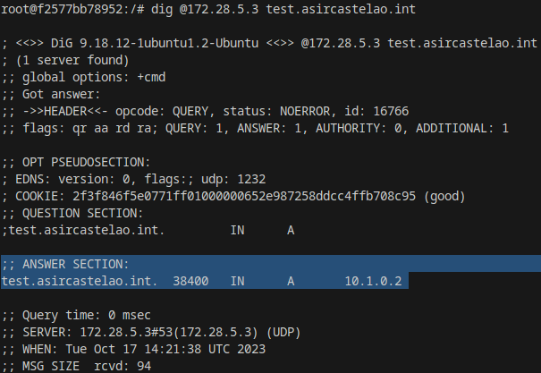
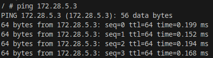
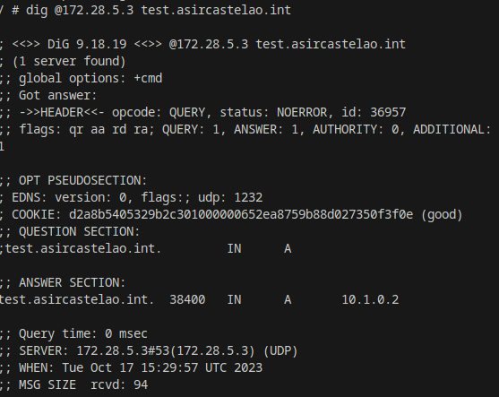
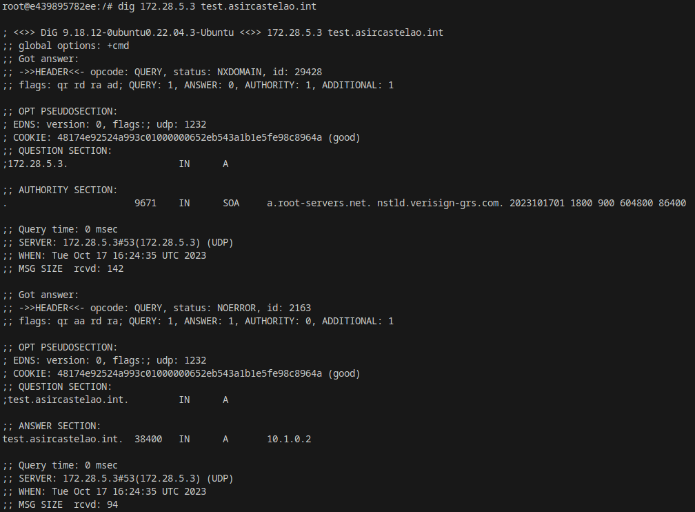
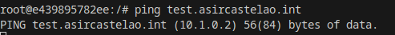

## Configura un contenedor con la imagen oficial de bind9 utilizando docker-compose.

***Primero creamos la network:***

    docker create network bind9_subnet

***Para personalizar los parámetros:***

        docker network create \
    --driver=bridge \
    --subnet=172.28.0.0/16 \
    --ip-range=172.28.5.0/24 \
    --gateway=172.28.5.254 \
***Despues configuramos el contenedor en un docker-compose.yml con los siguientes parámetros:***
    
    services:
        asir_bind9:
            container_name: asir_DNS1
            image: internetsystemsconsortium/bind9:9.16
            ports:
                - 53:53/tcp
                - 53:53/udp
            networks:
             bind9_subnet:
                 ipv4_address: 172.28.5.3
            volumes:
                 - ./conf:/etc/bind
                 - ./lib:/var/lib/bind
            networks:
                bind9_subnet: 
                external: true

    #Otra forma de hacerlo
    ##networks:
      ##network:
         ##ipam:
         ##config:
          ##subnet: 172.28.0.0/24
          ##gateway: 172.28.0.1

## Configuracion del DNS

***a) Dentro del directorio "DNS" creamos un fichero llamado "named.conf" y encribimos dentro lo siguiente para apuntar a nuestros ficheros:***

    include "/etc/bind/named.conf.options";
    include "/etc/bind/named.conf.local";
    include "/etc/bind/named.conf.default-zones";

***b) Después creamos los siguientes ficheros "named.conf.options", "named.conf.default-zones" y "named.conf.local" con las siguientes configuraciones:***

***"named.conf.options"***

    options {
        directory "/var/cache/bind";
        forwarders { 
                8.8.8.8;
                1.1.1.1;
        };
        forward only;

        listen-on { any; };
        listen-on-v6 { any; };
        allow-recursion {
                none;
        };
        allow-query {
                any;
        };
    };

***named.conf.default-zones***

    // prime the server with knowledge of the root servers
    zone "." {
	    type hint;
	    file "/usr/share/dns/root.hints";
    };

    // be authoritative for the localhost forward and reverse zones, and for
    // broadcast zones as per RFC 1912

    zone "localhost" {
	    type master;
	    file "/etc/bind/db.local";
    };

    zone "127.in-addr.arpa" {
	    type master;
	    file "/etc/bind/db.127";
    };

    zone "0.in-addr.arpa" {
	    type master;
	    file "/etc/bind/db.0";
    };

    zone "255.in-addr.arpa" {
	    type master;
	    file "/etc/bind/db.255";
    };

***named.conf.local***

    zone "asircastelao.int" {
	    type master;
	    file "/var/lib/bind/db.asircastelao.int";
	    allow-query {
		    any;
		};
	};

## Creamos tambien un fichero llamado "zonas" y dentro un fichero llamado "db.asircastelao.int" con la siguiente configuracion:

***db.asircastelao.int***

    $TTL 38400	; 10 hours 40 minutes
    @		IN SOA	ns.asircastelao.int. some.email.address. (
				10000002   ; serial
				10800      ; refresh (3 hours)
				3600       ; retry (1 hour)
				604800     ; expire (1 week)
				38400      ; minimum (10 hours 40 minutes)
				)
    @		IN NS	ns.asircastelao.int.
    ns		IN A 	10.1.0.254
    test	IN A	10.1.0.2
    alias	IN A    11.11.11.11
    alias	IN TXT    mensaje

## Comprobación con el comando 'dig' del correcto funcionamiento del DNS.

## Configuración del cliente

    asir_cliente:
        container_name: asir_cliente
        image: alpine
        networks:
        bind9_subnet:
            ipv4_address: 172.28.5.8
        stdin_open: true  # docker run -i
        tty: true         # docker run -t
    networks:
        bind9_subnet: 
        external: true

## Comprobación desde el cliente del funcionamiento del DNS.

***Realizamos un 'ping'***:

    ping [ip del servidor dns]

***Utilizamos el comando 'dig'***:

    dig @[ip del servidor] [nombre de recurso guardado en la db del servidor DNS].asircastealo.int

## Asignación de nuestro DNS server como DNS del cliente.

***En la configuración del cliente añadimos la sección 'dns' con la ip de este:***

    asir_cliente:
        container_name: asir_cliente
        image: alpine
        networks:
          bind9_subnet:
            ipv4_address: 172.28.5.8
        stdin_open: true  # docker run -i
        tty: true         # docker run -t
        dns:
         - 172.28.5.3 # Añadimos esta sección

***Dentro del cliente hacemos el siguiente comando:***

    echo "nameserver [ip del DNS Server]" > /etc/resolv.conf

***Hacemos el comando 'dig' para comprobar el correcto funcionamiento:***

***Hacemos el comando 'ping' para comprobar el correcto funcionamiento:***

